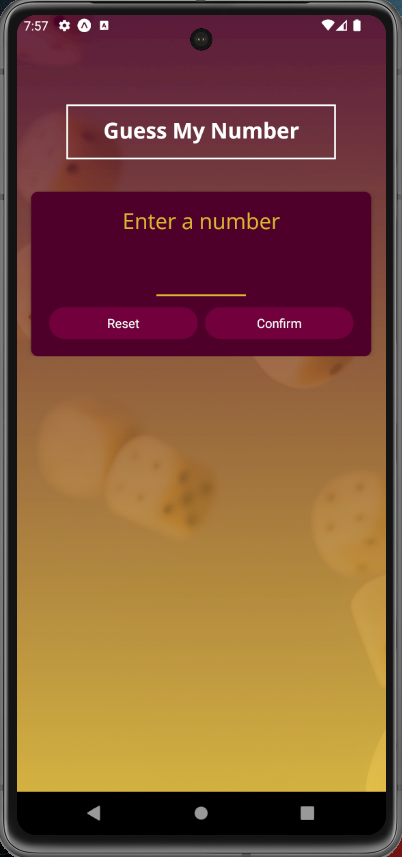
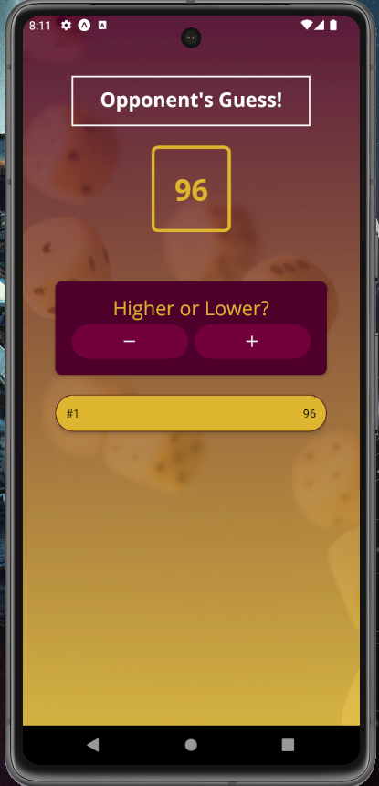
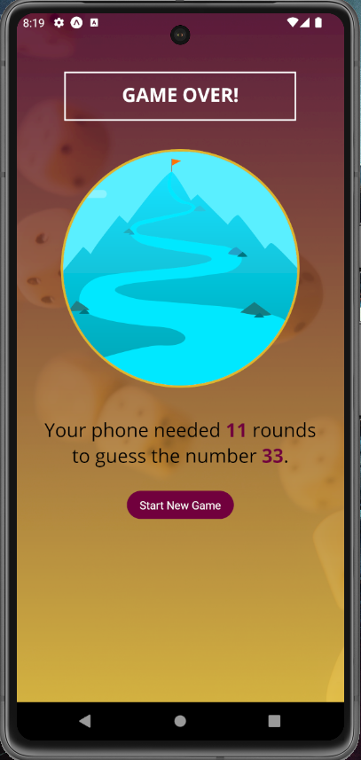

# Guess My Number - React Native

This is an React native application developed during an Udemy course, to learn some concepts like:

 - Component creation for reuse
 - Images
 - Orientation handling
 - Fonts
 - Create reusable styles
 - State management

The app goal is to guess the number typed, gicing the direction higher/lower until the number is guessed and the game is over,

## Screenshots

